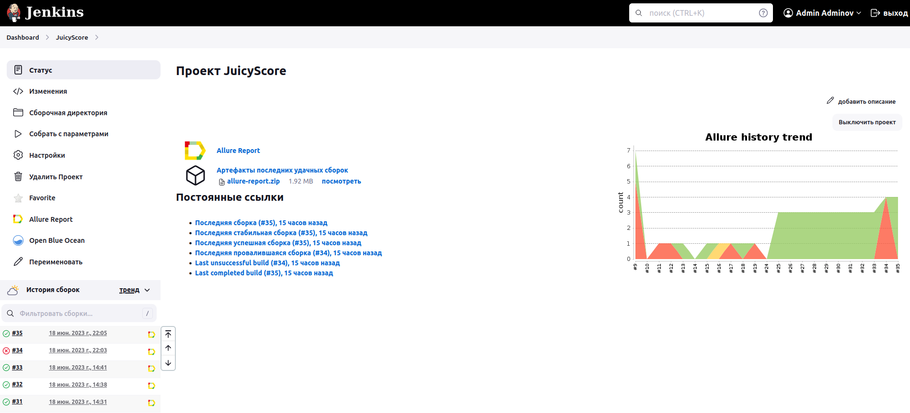
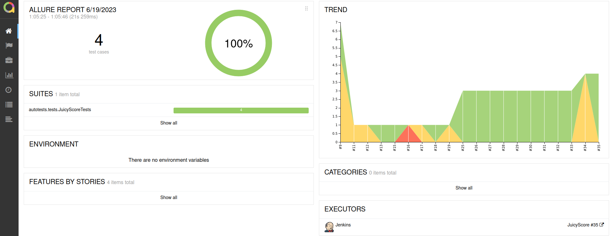
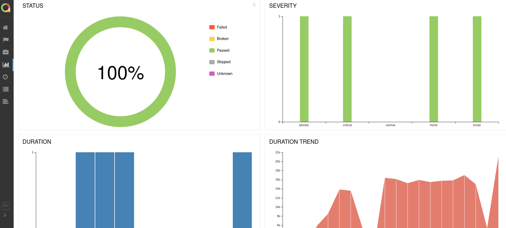
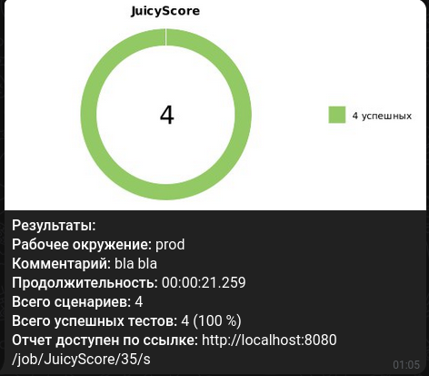

# Проект по автоматизации сайта Juicy Score


## 🚀: Содержание:

> ➠ [Технологии и инструменты](#earth_africa-технологии-и-инструменты)
>
> ➠ [Реализованные проверки](#earth_africa-Реализованные-проверки)
>
> ➠ [Сборка в Jenkins](#earth_africa-Jenkins-job)
>
> ➠ [Запуск из терминала](#earth_africa-Запуск-тестов-из-терминала)
>
> ➠ [Примеры использования](#earth_africa-Allure-отчет)
>
> ➠ [Allure отчет](#earth_africa-Allure-отчет)
>
> ➠ [Отчет в Telegram](#earth_africa-Уведомление-в-Telegram-при-помощи-бота)
>
> ➠ [Видео примеры прохождения тестов](#earth_africa-Примеры-видео-о-прохождении-тестов)


## 🧰: Технологии и инструменты

<p align="center">
<a href="https://www.jetbrains.com/idea/"></a>
<a href="https://www.java.com/"></a>
<a href="https://github.com/"></a>
<a href="https://junit.org/junit5/"></a>
<a href="https://gradle.org/"></a>
<a href="https://selenide.org/"></a>
<a href="https://aerokube.com/selenoid/"></a>
<a href="https://github.com/allure-framework/allure2"></a>
<a href="https://www.jenkins.io/"></a>
</p>

## ⚓: Реализованные проверки

## 🌀: Тест прогон 1
- ✓ Открыть сайт juicyscore.com
- ✓ Перейти в меню на страницу О нас
- ✓ Сменить язык содержимого сайта на английский (EN)
- ✓ Перейти на страницу с открытыми вакансиями
- ✓ Проверить что отображается заголовок вакансии "International business development manager"

## 🌀: Тест прогон 2
- ✓ Открыть страницу с формой для связи
- ✓ Заполнить и отправить форму
- ✓ Проверить что форма отправлена

## 🌀: Тест прогон 3
- ✓ Перейти на страницу juicyscore.com/ru/downloads/
- ✓ Проверить что скачанный файл содержит текст "Базовые принципы ценообразования"

## 🌀: Тест прогон 4
- ✓ Открыть сайт juicyscore.com
- ✓ Спуститься в футер
- ✓ Ввести почту и подписаться на рассылку
- ✓ Проверить что подписка оформлена


## </a> Jenkins <a target="_blank" href="http://localhost:8080/job/JuicyScore/"> job </a>
<p align="center">
<a href="http://localhost:8080/job/JuicyScore/"></a>
</p>


## 🧙: Параметры сборки в Jenkins:
-Dbrowser (браузер, по умолчанию chrome)

-DbrowserVersion (версия браузера, по умолчанию 99.)

-DbrowserSize (размер окна браузера, по умолчанию 1920x1080)

REMOTE_URL (Selenoid url, по умолчанию 192.168.31.160:8082/wd/hub)

## 🏗️: Запуск тестов из терминала
Локальный запуск:
```
gradle clean test
```

Удаленный запуск:
```
clean
test
-Dbrowser=${Browser}
-DbrowserVersion=${Browser_version}
-DbrowserSize=${Browser_size}

```

# Примеры использования

### Для запуска удаленных тестов необходимо заполнить remote.properties или передать значение:

* browser (default chrome)
* browserVersion (default 89.0)
* browserSize (default 1920x1080)
* remoteDriverUrl (url address from selenoid or grid)
* videoStorage (url address where you should get video)


Выдать отчет:
```bash
allure serve build/allure-results
```
## </a> Отчет в <a target="_blank" href="https://jenkins.autotests.cloud/job/IBS_test/allure/">Allure report</a>

## ⛅: Основной отчет
<p align="center">

</p>

## 🧪: Тесты 
<p align="center">

</p>

## 💹: Графики
<p align="center">

</p>

## </a> Уведомление в Telegram при помощи бота

<p align="center">

</p>


## ⬇️: Пример запуска тестов в Selenoid
## </a> Видео прохождения тестов </a>
https://github.com/BitFaIse/JuicyScore_UI_tests/assets/123478493/70abc86e-c713-4dce-9330-2b95bcccc57a
